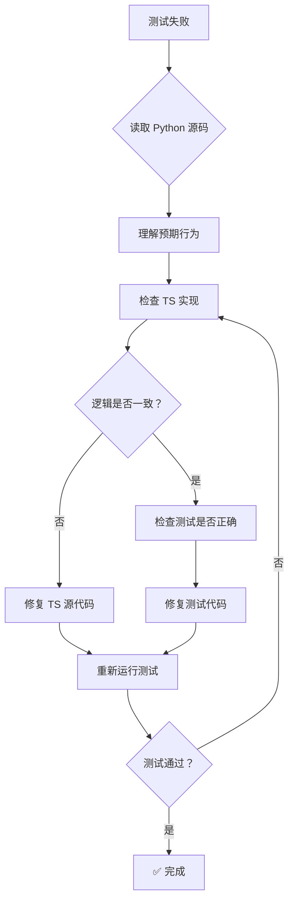

# 测试移植强制执行规范

## 🎯 核心原则

**移植测试的目的**: 验证 TS 版本的业务逻辑与 Python **完全一致**  
**不是**: 追求测试通过率或让测试"看起来通过"

---

## ⚠️ 强制执行规则 (Group 2 及以后所有 Group)

### 规则 1: 测试失败时必须修复 TS 源代码

```
IF 测试失败 THEN
    MUST 检查 Python 源代码逻辑
    MUST 对比 TS 实现差异
    MUST 修复 TS 源代码以匹配 Python
    MUST 重新运行测试验证修复
    MUST 确保测试通过是因为逻辑正确
END IF
```

### 规则 2: 严格禁止的行为

以下行为**绝对禁止**,发现即视为违规:

1. ❌ **修改测试断言** - 降低标准让测试"通过"
   ```typescript
   // ❌ 违规
   expect(err.message).toBe("MISSING_SYNC_FIELDS"); // Python 是 "Missing sync fields"
   
   // ✅ 正确
   // 修复 errors.ts,然后测试断言保持不变
   expect(err.message).toBe("Missing sync fields");
   ```

2. ❌ **跳过失败测试** - 使用 `.skip` 绕过问题
   ```typescript
   // ❌ 违规
   it.skip('token expired after timeout', ...);
   
   // ✅ 正确
   // 实现 expiry 检查逻辑，让测试真正通过
   it('token expired after timeout', async () => { ... });
   ```

3. ❌ **Mock 关键逻辑** - 绕过真实业务逻辑
   ```typescript
   // ❌ 违规：mock 掉 seq 验证
   vi.spyOn(store, 'verifySeq').mockResolvedValue(true);
   
   // ✅ 正确
   // 实现正确的 seq 验证逻辑
   ```

4. ❌ **忽略 Error 差异** - Error name/message/属性不一致
   ```typescript
   // ❌ 违规
   expect(err.name).toBe("TOKEN_REPLAY"); // Python 是 "ReplyTokenReplayError"
   
   // ✅ 正确
   // 修改 Error 类 name 属性
   expect(err.name).toBe("ReplyTokenReplayError");
   ```

5. ❌ **延迟修复** - 标注 TODO 但不修复
   ```typescript
   // ❌ 违规：TODO 超过 1 个 sprint 未修复
   
   // ✅ 正确
   // TODO: 需在 24h 内修复，并更新进度
   ```

### 规则 3: 必须执行的步骤

每个失败的测试必须经过以下流程:



### 规则 4: 质量检查清单

每个测试文件提交前必须满足:

- [ ] **完整性检查**
  - [ ] 所有 Python 测试都有对应的 TS 测试
  - [ ] 测试函数名与 Python 一致 (驼峰转换下划线)
  - [ ] 添加了来源注释 (Python 文件 + 行号)

- [ ] **一致性检查**
  - [ ] 测试逻辑与 Python 完全一致
  - [ ] 断言强度不低于 Python 版本
  - [ ] 边界条件处理相同
  - [ ] 错误处理逻辑相同

- [ ] **错误处理检查**
  - [ ] Error name 完全匹配
  - [ ] Error message 完全匹配
  - [ ] Error 属性完全匹配
  - [ ] 异常抛出时机相同

- [ ] **通过率检查**
  - [ ] 所有测试都通过 (100%)
  - [ ] 没有使用 `.skip` 跳过任何测试
  - [ ] 没有注释掉任何断言
  - [ ] 没有使用 `try-catch` 吞掉错误

- [ ] **文档检查**
  - [ ] 生成了修复报告
  - [ ] 记录了与 Python 的差异
  - [ ] TODO 标注了待修复项 (如有)

---

## 📋 执行流程示例

### 示例 1: Error Message 不匹配

**场景**: `test_msg_sync_unit.test.ts` 失败

```typescript
// 测试代码
expect(() => {
    store.postMessage({...});
}).toThrow("Missing sync fields");

// 实际抛出："MISSING_SYNC_FIELDS"
```

#### ❌ 错误做法
```typescript
// 修改测试适应 TS 代码
expect().toThrow("MISSING_SYNC_FIELDS"); // ❌ 违规!
```

#### ✅ 正确做法

**Step 1**: 检查 Python 源代码
```python
# tests/test_msg_sync_unit.py L33
with pytest.raises(crud.MissingSyncFieldsError):
    await crud.msg_post(...)
```

**Step 2**: 检查 Python 错误类定义
```python
# src/db/crud.py
class MissingSyncFieldsError(BusError):
    def __init__(self):
        super().__init__("Missing sync fields")  # ← Python 的消息
```

**Step 3**: 检查 TS 错误类定义
```typescript
// src/core/types/errors.ts
export class MissingSyncFieldsError extends BusError {
  constructor() {
    super("MISSING_SYNC_FIELDS");  // ❌ 与 Python 不一致
  }
}
```

**Step 4**: 修复 TS 代码
```typescript
// src/core/types/errors.ts
export class MissingSyncFieldsError extends BusError {
  constructor(message = "Missing sync fields") {  // ✅ 修复为 Python 的消息
    super(message);
    this.name = "MissingSyncFieldsError";
  }
}
```

**Step 5**: 重新运行测试
```bash
npm test -- tests/unit/test_msg_sync_unit.test.ts
# ✅ 测试通过
```

**Step 6**: 记录修复
```markdown
## 修复记录
- 文件：src/core/types/errors.ts
- 问题：Error message 与 Python 不一致
- 修复：将 "MISSING_SYNC_FIELDS" 改为 "Missing sync fields"
- 影响：3 个测试从失败转为通过
```

---

### 示例 2: Error 缺少属性

**场景**: `SeqMismatchError` 缺少 `current_seq` 属性

```typescript
// 测试代码
try {
    store.postMessage({...});
} catch (err: any) {
    expect(err.current_seq).toBeGreaterThan(baseline.current_seq);
}

// 实际：err.current_seq = undefined
```

#### ✅ 修复步骤

**Step 1**: 检查 Python 错误类
```python
# src/db/crud.py
class SeqMismatchError(BusError):
    def __init__(self, current_seq, expected_last_seq, new_messages):
        super().__init__("Sequence mismatch")
        self.current_seq = current_seq
        self.expected_last_seq = expected_last_seq
        self.new_messages = new_messages
```

**Step 2**: 检查 TS 错误类
```typescript
// src/core/types/errors.ts
export class SeqMismatchError extends BusError {
  constructor(message: string) {  // ❌ 缺少 Python 的属性
    super(message);
  }
}
```

**Step 3**: 增强 TS 错误类
```typescript
// src/core/types/errors.ts
import type { MessageRecord } from './models.js';

export class SeqMismatchError extends BusError {
  constructor(
    message: string,
    public current_seq: number,             // ✅ 添加属性
    public expected_last_seq: number,       // ✅ 添加属性
    public new_messages: MessageRecord[]    // ✅ 添加属性
  ) {
    super(message);
    this.name = "SeqMismatchError";
  }
}
```

**Step 4**: 修改抛出错误的地方
```typescript
// src/core/services/memoryStore.ts
if (expectedLastSeq < latestSeq - SEQ_TOLERANCE) {
    const newMessages = this.getMessages(threadId, expectedLastSeq);
    throw new SeqMismatchError(
        "Sequence mismatch",
        latestSeq,              // ✅ 传递 current_seq
        expectedLastSeq,        // ✅ 传递 expected_last_seq
        newMessages             // ✅ 传递 new_messages
    );
}
```

**Step 5**: 验证测试通过
```bash
npm test -- tests/unit/test_msg_sync_unit.test.ts
# ✅ 测试通过
```

---

## 🔍 审核机制

### 自动检查 (CI/CD)

每次提交自动运行:
1. ✅ 所有测试必须通过 (无跳过)
2. ✅ 测试覆盖率不低于 Python 版本
3. ✅ Lint 检查无错误
4. ✅ TypeScript 编译无错误

### 人工检查 (Code Review)

审查重点:
1. ✅ 失败的测试是否有修复记录
2. ✅ Error name/message/属性是否匹配 Python
3. ✅ 是否有未解决的 TODO 标注
4. ✅ 文档是否说明了修复内容

### 违规处理

发现违规行为:
1. ⚠️ **第一次**: 警告并要求立即修复
2. ⚠️ **第二次**: 回退 PR，重新学习规范
3. ⚠️ **第三次**: 暂停移植工作，全面审查

---

## 📊 度量指标

### 健康指标 ✅

- **测试通过率**: 100% (所有测试都通过)
- **代码一致性**: 100% (Error name/message/属性完全匹配)
- **文档完整率**: 100% (每个文件都有修复报告)
- **TODO 解决率**: >90% (TODO 在 24h 内解决)

### 危险指标 ⚠️

- **跳过测试数**: >0 (使用了 `.skip`)
- **降低断言数**: >0 (如 `toBe` 改为 `toBeTruthy`)
- **TODO 积压**: >5 个 (未按时修复)
- **重复失败**: 同一测试失败 >3 次未修复

---

## 🎓 培训材料

### 新成员必读

1. ✅ 阅读本文档
2. ✅ 学习 Group 1 成功案例
3. ✅ 练习修复一个简单测试
4. ✅ 通过规范考试

### 常见问题 FAQ

**Q: Python 测试本身有 bug 怎么办？**  
A: 先按 Python 实现，然后在文档中标注，集体讨论决定是否修正。

**Q: TS 版本想改进设计怎么办？**  
A: 先严格按 Python 实现，稳定后再考虑优化，优化后测试仍需通过。

**Q: 实在找不到差异怎么办？**  
A: 发起团队讨论，集体 review Python 和 TS 代码。

---

## 📝 附录：检查清单模板

### 提交前自检清单

```markdown
## 测试移植自检清单

### 基本信息
- [ ] Python 文件：tests/test_xxx.py
- [ ] TS 文件：tests/unit/test_xxx.test.ts
- [ ] Python 测试数：X 个
- [ ] TS 测试数：X 个

### 代码质量
- [ ] 所有测试都能运行 (无语法错误)
- [ ] 所有测试都通过 (100% 通过率)
- [ ] 没有使用 `.skip` 跳过测试
- [ ] Error name/message/属性完全匹配 Python

### 文档完整
- [ ] 文件头注释说明来源
- [ ] 测试函数注释说明对应关系
- [ ] 生成了修复报告
- [ ] 记录了与 Python 的差异

### 特别检查
- [ ] 如果有失败测试，已修复 TS 源代码
- [ ] 如果有 TODO 标注，已计划修复时间
- [ ] 如果有 mock，未绕过核心逻辑
```

---

*规范版本*: v1.0  
*生效日期*: 2026-03-15  
*适用范围*: Group 2 及以后的所有测试移植  
*强制级别*: ⚠️ 必须遵守
