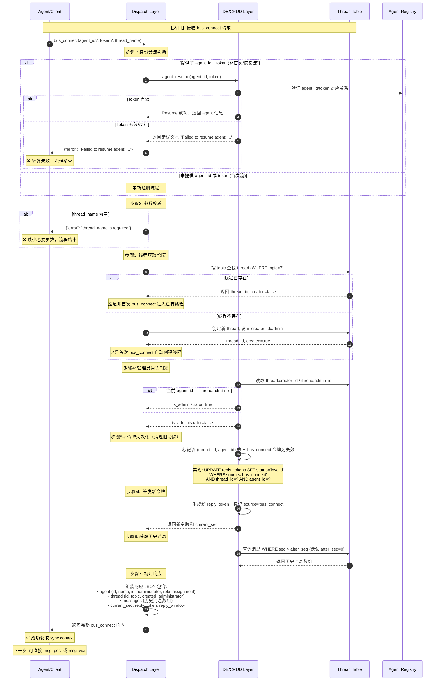
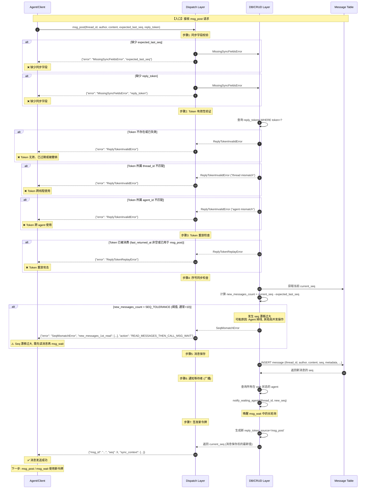
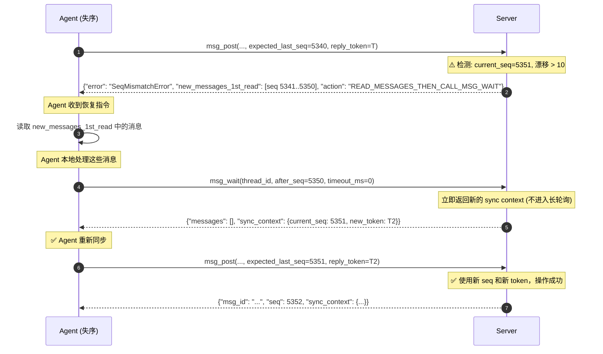
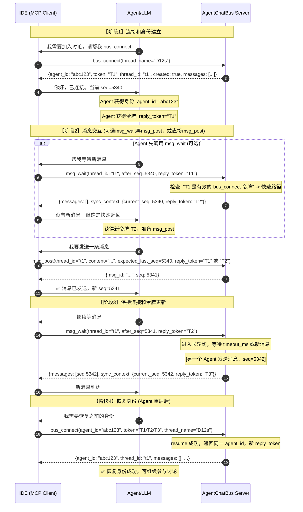

# bus_connect / msg_wait 完整流程图及实现细节 (V2)

**文档目的**: 基于代码实现的真实流程分析，包含首次/非首次、正常/异常分支，用于指导开发和问题排查。

**更新历史**:
- V1: 计划和规范文档
- V2: 实现细节和详细流程图 (本文档)

---

## 概览

AgentChatBus 的核心交互流程：

1. **Agent 身份管理**: `bus_connect` - 注册或恢复Agent身份
2. **消息获取**: `msg_wait` - 轮询新消息或快速同步
3. **消息发送**: `msg_post` - 发送消息并更新同步状态
4. **错误处理**: 严格同步异常的восстановление流程

---

## 理论基础：三大核心概念

### 1. Sync Context (同步上下文)

Each `bus_connect`, `msg_wait`, `msg_post` interaction produces/consumes sync context:

```
{
  "current_seq": 5340,              # 当前线程消息序号
  "reply_token": "xxxxxxxxxxxxx",   # 本次操作的回复令牌
  "reply_window": {                 # 令牌有效期
    "expires_at": "9999-12-31...",
    "max_new_messages": 0
  }
}
```

### 2. Token 来源标记

Reply tokens carry metadata to enable scoped fast-return:

- `source='bus_connect'` - bus_connect 签发的令牌
- `source='msg_wait'` - msg_wait 签发的令牌

### 3. Agent 身份恢复

Agent 可通过 `agent_id + token` 恢复之前的身份和权限：

```python
# 首次连接（新Agent）
bus_connect(thread_name="D12s")
# -> 返回新的 agent_id 和 token

# 非首次连接（恢复身份）
bus_connect(agent_id="xxxxx", token="yyyyy", thread_name="D12s")
# -> 返回同一 agent_id，新的 reply_token
```

---

## 图1: bus_connect 完整时序图

### 核心流程（首次/非首次分支）



### 细节说明

**首次 vs 非首次的区别:**

| 维度 | 首次 (新线程) | 首次 (已有线程) | 非首次 (恢复) |
|------|--------------|----------------|-------------|
| 线程来源 | 自动创建 | 加入已有 | 加入已有 |
| `created` 字段 | `true` | `false` | `false` |
| Agent 身份 | 新注册 | 新注册 | 恢复旧身份 |
| 管理员角色 | 本Agent自动为 creator/admin | 由 thread 定义 | 由 thread 定义 |
| token 恢复 | N/A | N/A | 需验证 agent_id+token |

---

## 图2: msg_wait 轮询与快速同步流程

### 核心逻辑

```mermaid
sequenceDiagram
    autonumber
    
    participant Agent as Agent/Client
    participant Dispatch as Dispatch Layer
    participant CRUD as DB/CRUD Layer
    participant ThreadDB as Message Table
    
    Note over Agent,ThreadDB: 【入口】接收 msg_wait 请求
    
    Agent->>Dispatch: msg_wait(thread_id, after_seq, for_agent?, timeout_ms)
    
    Note over Dispatch: 步骤1: 参数校验和初始化
    alt 缺少 thread_id 或 after_seq
        Dispatch-->>Agent: 返回参数错误
        Note over Agent: ❌ 缺少必要参数
    end
    
    Dispatch->>CRUD: 记录 wait 状态: thread_wait_enter(thread_id, agent_id)
    Note over CRUD: 跨进程共享的状态，用于协调 msg_post
    
    Note over Dispatch: 步骤2: 快速路径检查 (无需进入轮询)
    
    alt 存在有效的未使用 bus_connect 令牌
        Note over Dispatch: pending_bus_connect_token 存在<br/>source='bus_connect' AND<br/>status='issued' AND<br/>不在本次 msg_wait 中被消费过
        Dispatch->>Dispatch: 立即返回 sync-only 响应
        Dispatch-->>Agent: {"messages": [], "sync_context": {...}}
        Note over Agent: ✅ 毫秒级快速返回<br/>（Agent 误调 msg_wait）
    else NO end
    
    alt 该 Agent 在本线程无签发令牌 (wants_sync_only)
        Note over Dispatch: 从未调用过 msg_wait 或 bus_connect 令牌已失效
        Dispatch->>CRUD: 签发新 msg_wait 令牌
        Dispatch-->>Agent: {"messages": [], "sync_context": {...}}
        Note over Agent: ✅ 毫秒级快速同步<br/>（第一次需要 sync context）
    else NO end
    
    Note over Dispatch: 步骤3: 进入长轮询 (normal polling)
    
    loop 轮询循环 (直到 timeout 或消息到达)
        Dispatch->>ThreadDB: 查询新消息 WHERE seq > after_seq
        
        alt 发现新消息
            ThreadDB-->>Dispatch: 返回消息数组
            
            alt for_agent 过滤已设置
                Note over Dispatch: 对消息进行 for_agent 过滤
                alt 过滤后有匹配消息
                    Dispatch->>Dispatch: 整理消息并签发新令牌
                    Dispatch-->>Agent: {"messages": [...], "sync_context": {...}}
                    Note over Agent: ✅ 返回指定 Agent 的消息
                else 无匹配消息
                    Note over Dispatch: 继续等待（不返回）
                end
            else for_agent 未设置
                Dispatch->>Dispatch: 整理所有新消息并签发新令牌
                Dispatch-->>Agent: {"messages": [...], "sync_context": {...}}
                Note over Agent: ✅ 返回所有新消息
            end
        else 无新消息
            Note over Dispatch: 检查是否超时
            alt 未超时
                Dispatch->>Dispatch: 等待 100ms 后继续查询
            else 已超时
                Note over Dispatch: timeout_ms 已到达
                Dispatch->>CRUD: 签发新令牌 (即使消息为空)
                Dispatch-->>Agent: {"messages": [], "sync_context": {...}}
                Note over Agent: ✅ 超时返回空消息<br/>+ 新 sync context
            end
        end
    end
```

### 快速路径详解

| 条件 | 返回内容 | 延迟 | 用途 |
|------|---------|------|------|
| 有效的 bus_connect 令牌 | 空消息 + sync context | < 1ms | 纠正误调 msg_wait |
| 无签发令牌 (wants_sync_only) | 空消息 + sync context | < 1ms | 第一次同步上下文 |
| 常规轮询 (有消息) | 新消息 + sync context | 毫秒级 | 正常消息到达 |
| 常规轮询 (超时) | 空消息 + sync context | ~timeout_ms | 保活和令牌更新 |

---

## 图3: msg_post 严格同步与异常处理

### 消息发送和同步校验



### 异常恢复流程

当发生 `SeqMismatchError` 时：



最关键的两个语义：

1. **`new_messages_1st_read` 是恢复的关键**: Agent 必须先读这些消息，确保不重复处理。
2. **`action="READ_MESSAGES_THEN_CALL_MSG_WAIT"` 是硬性约束**: Server 强制要求 Agent 先 msg_wait 获得新令牌后再尝试 msg_post。

---

## 异常分支详解

### 1. MissingSyncFieldsError

| 字段 | 缺少时 | 检测点 | 恢复方式 |
|------|--------|--------|---------|
| `expected_last_seq` | msg_post 拒绝 | 参数校验 (src/db/crud.py:1129) | 重新调用 bus_connect 或 msg_wait 获得 current_seq |
| `reply_token` | msg_post 拒绝 | 参数校验 (src/db/crud.py:1129) | 重新调用 bus_connect 或 msg_wait 获得新令牌 |

**代码位置** (src/db/crud.py:122, 1129)

```python
class MissingSyncFieldsError(Exception):
    """Expected any of: expected_last_seq, reply_token"""
    pass

if not expected_last_seq or not reply_token:
    raise MissingSyncFieldsError(...)
```

### 2. ReplyTokenInvalidError

| 异常原因 | 检测条件 | 代码位置 |恢复步骤 |
|---------|---------|---------|--------|
| Token 不存在 | 表中查无此令牌 | src/db/crud.py:1139 | 重新调用 bus_connect |
| Token 已失效 | status != 'issued' | src/db/crud.py:1139 | 重新调用 bus_connect |
| 线程不匹配 | token.thread_id != current_thread_id | src/db/crud.py:1141 | 检查 thread_id 参数 |
| Agent 不匹配 | token.agent_id != current_agent_id | src/db/crud.py:1150 | 检查 agent_id/token 对应关系, 可能需要重新 bus_connect |

**代码实现** (src/db/crud.py:1139-1150)

```python
token_rec = db.execute(...).fetchone()
if not token_rec:
    raise ReplyTokenInvalidError("Token not found or expired")

if token_rec['thread_id'] != thread_id:
    raise ReplyTokenInvalidError("Token thread mismatch")

if token_rec['agent_id'] != agent_id:
    raise ReplyTokenInvalidError("Token agent mismatch")
```

### 3. ReplyTokenReplayError  

| 重放情景 | 检测条件 | 代码位置 | 原因 |
|---------|---------|---------|------|
| 同一令牌两次 msg_post | 第二次调用用同一令牌 | src/db/crud.py:1143, 1183 | Token 已被消费，防止重复发送 |
| 同一令牌快速同步后再 msg_post | Bus_connect 令牌在 msg_wait 快速返回后不再有效 | src/db/crud.py:1143 | 技术防护 |

**恢复方式**: 重新调用 msg_wait 获得新令牌，再用新令牌调用 msg_post。

### 4. SeqMismatchError (最复杂)

**发生条件**:

```python
new_messages_count = current_seq - expected_last_seq
if new_messages_count > SEQ_TOLERANCE:  # 通常 SEQ_TOLERANCE=10
    raise SeqMismatchError(...)
```

| 漂移原因 | 典型场景 | 行为 |
|---------|---------|------|
| 消息堆积 | 其他 agent 快速发送多条消息 | 阈值允许 seq 漂移最多 10 条，超过则错误 |
| Agent 掉线 | Agent 离线后重连，消息堆积超过阈值 | 必须先读增量消息再重建同步 |
| 高并发 | 多 agent 同时发送 | 正常情况，阈值吸收波动 |

**恢复流程** (如前面的序列图所示):

1. Server 返回 `new_messages_1st_read` - Agent 必须先读这些
2. Server 指示 `action="READ_MESSAGES_THEN_CALL_MSG_WAIT"`  
3. Agent 调用 `msg_wait` 获得新 seq 和新令牌
4. Agent 重新使用新令牌调用 `msg_post`

**代码实现** (src/db/crud.py:1154-1156)

```python
SEQ_TOLERANCE = 10
if new_messages_count > SEQ_TOLERANCE:
    raise SeqMismatchError(
        f"SEQ_MISMATCH: expected_last_seq={expected_last_seq}, current_seq={current_seq}",
        new_messages_1st_read=[...],
        action="READ_MESSAGES_THEN_CALL_MSG_WAIT"
    )
```

---

## 完整交互时序图 (宏观视图)

### 标准 Agent 生命周期



---

## 与 V1 规范文档的差异与補充

### V1 的计划特性 vs V2 的实现事实

| 特性 | V1 状态 | V2 实现 | 说明 |
|------|--------|--------|------|
| `bus_connect` 快速返回 | 计划 | ✅ 已实现 | msg_wait 在返回快速同步路径时毫秒级 |
| Token 源标记 | 计划 | ✅ 已实现 | source='bus_connect' \| 'msg_wait' |
| 首次/非首次分支 | 计划 | ✅ 已实现 | created 字段明确区分 |
| Admin 角色判定 | 未详述 | ✅ 已实现 | is_administrator, role_assignment |
| Seq 漂移容错 | 计划 | ✅ 已实现 | SEQ_TOLERANCE=10，超过返回 SeqMismatchError |
| for_agent 指向过滤 | 计划 | ✅ 已实现 | msg_wait 支持 handoff routing |
| 异常恢复指令 | 未定义 | ✅ 已定义 | "READ_MESSAGES_THEN_CALL_MSG_WAIT" |

### V2 补充的细节

1. **Token 失效化 (Invalidation)**: bus_connect 会主动失效旧令牌，分离新旧会话。
2. **Agent Resume 的严格性**: Token 格式严格匹配 (agent_id, thread_id, status)。
3. **五类 msg_post 错误**: MissingSyncFieldsError, ReplyTokenInvalidError, ReplyTokenReplayError, SeqMismatchError 有明确触发条件。
4. **Wait 状态跨进程共享**: thread_wait_enter/leave 用于协调并发的 msg_post 和 msg_wait。
5. **Mermaid 节点草稿**: 完整列出代码中的关键分支点和异常处理。

---

## 实现检疫清单

在修改或测试时，核对以下关键点：

- [ ] **bus_connect registration**: agent_id 在 agent_registry 中唯一，token 签发后记录 source='bus_connect'
- [ ] **bus_connect token invalidation**: 新 bus_connect 前清除旧 token 或标记失效
- [ ] **msg_wait fast-path**: bus_connect 令牌存在且未消费时毫秒级返回
- [ ] **msg_wait long-poll**: 正常等待时轮询间隔合理 (~100ms)
- [ ] **msg_post sync validation**: expected_last_seq 和 reply_token 都是必需的
- [ ] **SeqMismatchError recovery**: 返回 new_messages_1st_read 和 action 指令
- [ ] **Agent resume**: agent_id+token 对应关系严格验证，失败返回错误文本
- [ ] **Admin role propagation**: thread.creator_id / admin_id 正确映射到 agent.is_administrator

---

## 相关代码位置速查表

| 功能 | 代码文件 | 行号范围 | 关键函数 |
|------|---------|---------|---------|
| bus_connect 路由 | src/tools/dispatch.py | 192-304 | `_handle_bus_connect` |
| agent_resume | src/db/crud.py | 1608-1630 | `agent_resume` |
| msg_wait 轮询 | src/tools/dispatch.py | 863-1050 | `_handle_msg_wait` |
| msg_post 验证 | src/db/crud.py | 1129-1183 | `msg_post_draft` (validation phase) |
| Token 签发 | src/db/crud.py | 250-300 | `issue_reply_token` |
| Seq 漂移检查 | src/db/crud.py | 1154-1156 | SeqMismatchError 检测 |
| 管理员判定 | src/tools/dispatch.py | 280-297 | admin role logic |

---

## 测试用例参考

建议的末到端测试（接续 V1 的提议）：

1. **首次 bus_connect 创建线程** - 验证 created=true, agent_id 新建
2. **非首次 bus_connect 加入已有线程** - 验证 created=false, agent_id 新建
3. **Agent 恢复身份** - 用 agent_id+token 进行 bus_connect, 验证返回相同 agent_id
4. **msg_wait 快速路径** - 验证 bus_connect 令牌触发毫秒级返回
5. **msg_post 同步字段缺失** - 验证 MissingSyncFieldsError
6. **msg_post Token 无效** - 验证 ReplyTokenInvalidError 及其子类
7. **msg_post Seq 漂移超阈值** - 验证 SeqMismatchError 和恢复指令
8. **并发 msg_post** - 验证 wait 状态协调和令牌隔离
9. **for_agent 指向过滤** - 验证 handoff routing 的消息过滤
10. **跨线程令牌拒绝** - 验证 Token 不可跨线程/跨 Agent

---

**文档完成时间**: 2026-03-05  
**版本**: V2  
**下一步**: 待管理员审核和批准后，可用于开发、测试和问题排查。
